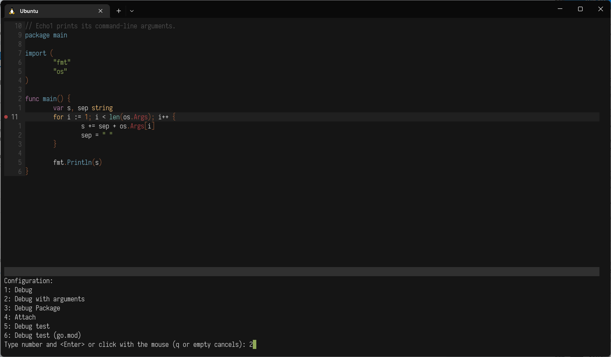
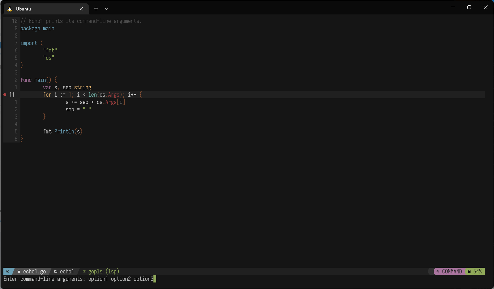
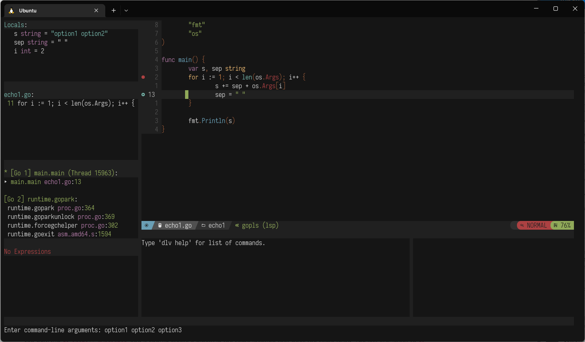

# nvim-dap-go

An extension for [nvim-dap][1] providing configurations for launching go debugger (delve) and debugging individual tests.

## Features

- Auto launch Delve. No configuration needed. You just have to have `dlv` in your path.
- Run just the closest test from the cursor in debug mode (uses treesitter). See [debugging individual tests](#debugging-individual-tests) section below for more details.
- Configuration to attach nvim-dap and Delve into a running process and start a debug session.
- Configuration to start a debug session in the main function.
- Configuration to run tests in a debug session.
- Final Delve configuration is resolved when a debug session starts. This allows to use different addresses and ports for each project or launch configs in a project.

## Pre-reqs

- Neovim >= 0.9.0
- [nvim-dap][1]
- [delve][2] >= 1.7.0

This plugin extension make usage of treesitter to find the nearest test to debug.
Make sure you have the Go treesitter parser installed.
If using [nvim-treesitter][3] plugin you can install with `:TSInstall go`.

## Installation

- Install like any other neovim plugin:
  - If using [vim-plug][4]: `Plug 'leoluz/nvim-dap-go'`
  - If using [packer.nvim][5]: `use 'leoluz/nvim-dap-go'`

## Usage

### Register the plugin

Call the setup function in your `init.vim` to register the go adapter and the configurations to debug go tests:

```vimL
lua require('dap-go').setup()
```

### Configuring

It is possible to customize nvim-dap-go by passing a config table in the setup function.

The example below shows all the possible configurations:

```lua
lua require('dap-go').setup {
  -- Additional dap configurations can be added.
  -- dap_configurations accepts a list of tables where each entry
  -- represents a dap configuration. For more details do:
  -- :help dap-configuration
  dap_configurations = {
    {
      -- Must be "go" or it will be ignored by the plugin
      type = "go",
      name = "Attach remote",
      mode = "remote",
      request = "attach",
    },
  },
  -- delve configurations
  delve = {
    -- the path to the executable dlv which will be used for debugging.
    -- by default, this is the "dlv" executable on your PATH.
    path = "dlv",
    -- time to wait for delve to initialize the debug session.
    -- default to 20 seconds
    initialize_timeout_sec = 20,
    -- a string that defines the port to start delve debugger.
    -- default to string "${port}" which instructs nvim-dap
    -- to start the process in a random available port.
    -- if you set a port in your debug configuration, its value will be
    -- assigned dynamically.
    port = "${port}",
    -- additional args to pass to dlv
    args = {},
    -- the build flags that are passed to delve.
    -- defaults to empty string, but can be used to provide flags
    -- such as "-tags=unit" to make sure the test suite is
    -- compiled during debugging, for example.
    -- passing build flags using args is ineffective, as those are
    -- ignored by delve in dap mode.
    -- avaliable ui interactive function to prompt for arguments get_arguments
    build_flags = {},
    -- whether the dlv process to be created detached or not. there is
    -- an issue on delve versions < 1.24.0 for Windows where this needs to be
    -- set to false, otherwise the dlv server creation will fail.
    -- avaliable ui interactive function to prompt for build flags: get_build_flags
    detached = vim.fn.has("win32") == 0,
    -- the current working directory to run dlv from, if other than
    -- the current working directory.
    cwd = nil,
  },
  -- options related to running closest test
  tests = {
    -- enables verbosity when running the test.
    verbose = false,
  },
}
```

### Use nvim-dap as usual

- Call `:lua require('dap').continue()` to start debugging.
- All pre-configured debuggers will be displayed for you to choose from.
- See `:help dap-mappings` and `:help dap-api`.

### Debugging individual tests

To debug the closest method above the cursor use you can run:

- `:lua require('dap-go').debug_test()`

Once a test was run, you can simply run it again from anywhere:

- `:lua require('dap-go').debug_last_test()`

It is better to define a mapping to invoke this command. See the mapping section below.

### Debugging with command-line arguments

1. Select the option `Debug (Arguments)`
1. Enter each argument separated by a space (i.e. `option1 option2 option3`)
1. Press enter





### Debugging with build flags

1. Register a new option to debug with build flags:

```lua
require('dap-go').setup {
  dap_configurations = {
    {
      type = "go",
      name = "Debug (Build Flags)",
      request = "launch",
      program = "${file}",
      buildFlags = require("dap-go").get_build_flags,
    },
  },
})
```

2. To prompt for both build flags and arguments register the following:

```lua
require("dap-go").setup({
    dap_configurations = {
        {
            type = "go",
            name = "Debug (Build Flags & Arguments)",
            request = "launch",
            program = "${file}",
            args = require("dap-go").get_arguments,
            buildFlags = require("dap-go").get_build_flags,
        },
    }
})
```

3. To create a custom debugging configuration that requires an interactive prompt the following functions can be
   attached to the args and buildFlags fields of dap_configurations.
   - `require('dap-go').get_arguments`
   - `require('dap-go').get_buid_flags`

### Debugging with dlv in headless mode

1. Register a new option to attach to a remote debugger:

```lua
lua require('dap-go').setup {
  dap_configurations = {
    {
      type = "go",
      name = "Attach remote",
      mode = "remote",
      request = "attach",
    },
  },
}
```

1. Start `dlv` in headless mode. You can specify subcommands and flags after `--`, e.g.,

```sh
dlv debug -l 127.0.0.1:38697 --headless ./main.go -- subcommand --myflag=xyz
```

1. Call `:lua require('dap').continue()` to start debugging.
1. Select the new registered option `Attach remote`.

## Mappings

```vimL
nmap <silent> <leader>td :lua require('dap-go').debug_test()<CR>
```

## VSCode launch config

Defining the Go debug configurations for all your projects inside your Neovim configuration can be cumbersome and quite strict.
For more flexibility, `nvim-dap` supports the use of the VSCode launch configurations.

That allows for example to set the Delve port dynamically when you run a debug session. If you create this file in your project (`[root_project]/.vscode/launch.json`):

```json
{
    "version": "0.2.0",
    "configurations": [
        {
            "name": "Remote debug API server",
            "type": "go",
            "request": "attach",
            "mode": "remote",
            "port": 4444,
            "host": "127.0.0.1",
            "substitutePath": [
                {
                    "from": "${workspaceFolder}", "to": "/usr/src/app"
                }
            ]
        }
    ]
}
```

A debug session `Remote debug API server` will appear in the choices, and the Delve port will be dynamically set to `4444`.
The current version of nvim-dap always loads the file if it exists.

Please see `:h dap-launch.json` for more information.

## Acknowledgement

Thanks to the [nvim-dap-python][6] for the inspiration.

[1]: https://github.com/mfussenegger/nvim-dap
[2]: https://github.com/go-delve/delve
[3]: https://github.com/nvim-treesitter/nvim-treesitter
[4]: https://github.com/junegunn/vim-plug
[5]: https://github.com/wbthomason/packer.nvim
[6]: https://github.com/mfussenegger/nvim-dap-python
